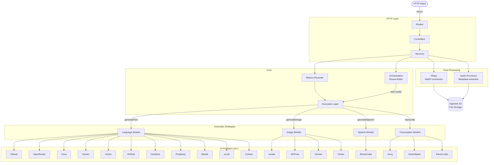

# ai-service

A unified multimodal AI API service that aggregates **16+ AI providers** behind a single REST interface. Built with [Bun](https://bun.sh), [Elysia](https://elysiajs.com), and [Vercel AI SDK v6](https://ai-sdk.dev).

Supports **text generation**, **image generation**, **audio synthesis (TTS)**, and **audio transcription** with automatic round-robin load balancing across all registered models.

## Table of Contents

- [Architecture](#architecture)
- [Project Structure](#project-structure)
- [API Endpoints](#api-endpoints)
- [AI Providers & Models](#ai-providers--models)
- [Environment Variables](#environment-variables)
- [Getting Started](#getting-started)
- [Adding a New Provider](#adding-a-new-provider)
- [License](#license)

## Architecture



**Key patterns:**

- **Round-robin model selection** — each request cycles to the next available model in the pool, distributing load across providers.
- **Metrics recording** — wraps every execution call with latency tracking, token usage, and error metadata.
- **Streaming support** — text generation supports Server-Sent Events (SSE) via `ReadableStream`.
- **Three image strategies** — `generateImage` (OpenAI-compatible like nscale), `generateText` with image modalities (Gemini/Vertex), and custom async polling (APIFree).
- **Unified response format** — all endpoints return `{ success, data, error, modelMetadata }`.

## Project Structure

```
index.ts                        # Elysia app entry point
src/
├── config.ts                   # Environment variables (dotenv)
├── core/
│   ├── logger.ts               # Pino logger configuration
│   ├── execution/              # AI task execution layer
│   │   ├── text.ts             # generateText / streamText
│   │   ├── image.ts            # generateImage / generateText (image) / custom
│   │   ├── audio.ts            # experimental_generateSpeech
│   │   ├── transcription.ts    # experimental_transcribe
│   │   └── types.d.ts          # Execution input/output types
│   ├── metrics/
│   │   ├── recorder.ts         # Latency & usage metrics wrapper
│   │   └── types.d.ts          # Metrics types
│   ├── orchestration/
│   │   └── index.ts            # Model registries + round-robin selection
│   └── streaming/
│       ├── events.ts           # StreamEvent type definitions
│       └── stream-builder.ts   # ReadableStream from AsyncGenerator
├── http/
│   ├── controllers/            # Request handling + response formatting
│   │   ├── text.ts
│   │   ├── image.ts
│   │   ├── audio.ts
│   │   └── transcription.ts
│   ├── middlewares/
│   │   ├── error.ts            # Global error handler + AppError class
│   │   ├── json.ts             # Content-Type validation
│   │   └── normalizePath.ts    # Trailing slash redirect
│   ├── openapi/
│   │   └── open-api.ts         # Response schema factory
│   └── routes/
│       ├── text.ts
│       ├── image.ts
│       ├── audio.ts
│       └── transcription.ts
├── infra/
│   ├── ai/                     # AI provider configurations
│   │   ├── apifree.ts          # APIFree (Qwen image, async polling)
│   │   ├── assembly.ts         # AssemblyAI (transcription)
│   │   ├── cerebras.ts         # Cerebras (text)
│   │   ├── cohere.ts           # Cohere (text)
│   │   ├── eleven.ts           # ElevenLabs (TTS + transcription)
│   │   ├── gemini.ts           # Google Gemini (text + image)
│   │   ├── github.ts           # GitHub Models (text)
│   │   ├── groq.ts             # Groq (text + transcription)
│   │   ├── hugginface.ts       # HuggingFace (image — not in rotation)
│   │   ├── ministral.ts        # Mistral (text)
│   │   ├── nscale.ts           # nscale (image)
│   │   ├── nvidia.ts           # NVIDIA NIM (text)
│   │   ├── olm.ts              # oLLM (text)
│   │   ├── open-router.ts      # OpenRouter (text)
│   │   ├── perplexity.ts       # Perplexity (text)
│   │   ├── vercel.ts           # Vercel AI Gateway (image — not in rotation)
│   │   └── vertex.ts           # Vertex AI (text + image)
│   ├── database/
│   │   └── appwrite.ts         # Appwrite client
│   ├── processors/
│   │   ├── audio.ts            # Audio metadata extraction + URL fetch
│   │   └── sharp.ts            # Image conversion to WebP
│   └── storage/
│       └── appwrite.ts         # Appwrite S3-compatible file storage
├── schemas/                    # Zod v4 validation schemas
│   ├── audio.ts
│   ├── image.ts
│   ├── stream.ts
│   ├── text.ts
│   └── transcription.ts
├── services/                   # Business logic layer
│   ├── text.ts
│   ├── image.ts
│   ├── audio.ts
│   └── transcription.ts
└── types/
    └── index.ts                # Shared type definitions
```

## API Endpoints

All endpoints return the standard response envelope:

```json
{
  "success": true,
  "data": { "..." },
  "error": null,
  "modelMetadata": {
    "provider": "gemini",
    "modelId": "gemini-3-flash",
    "type": "text"
  }
}
```

OpenAPI documentation is available at `/openapi` when the server is running.

---

### Text Generation

#### `POST /text/generate`

Generates text from a prompt using the next available text model.

| Field    | Type     | Required | Description     |
| -------- | -------- | -------- | --------------- |
| `prompt` | `string` | Yes      | Min 1 character |

**Response `data`:**

```json
{ "text": "...", "length": 42, "modelMetadata": { "..." } }
```

**cURL example:**

```bash
curl -X POST http://localhost:3000/text/generate \
  -H "Content-Type: application/json" \
  -d '{"prompt": "Explain quantum computing in 3 sentences"}'
```

---

#### `POST /text/stream`

Streams text generation via Server-Sent Events.

| Field    | Type     | Required |
| -------- | -------- | -------- |
| `prompt` | `string` | Yes      |

Returns `text/event-stream` with JSON-encoded `StreamEvent` objects:

```
{ "type": "start", "modelMetadata": { ... } }
{ "type": "delta", "content": "chunk of text" }    ← repeated
{ "type": "end" }
```

**cURL example:**

```bash
curl -N -X POST http://localhost:3000/text/stream \
  -H "Content-Type: application/json" \
  -d '{"prompt": "Write a short story about AI"}'
```

---

### Image Generation

#### `POST /image/generate`

Generates an image, converts it to WebP, and uploads it to storage.

| Field    | Type     | Required |
| -------- | -------- | -------- |
| `prompt` | `string` | Yes      |

**Response `data`:**

```json
{
  "imageUrl": "https://...",
  "width": 1024,
  "height": 1024,
  "altText": "Generated image for prompt: ..."
}
```

**cURL example:**

```bash
curl -X POST http://localhost:3000/image/generate \
  -H "Content-Type: application/json" \
  -d '{"prompt": "A city skyline at sunset, digital art"}'
```

---

### Audio Generation (TTS)

#### `POST /audio/generate`

Generates speech from text using ElevenLabs and uploads to storage.

| Field     | Type     | Required | Description                              |
| --------- | -------- | -------- | ---------------------------------------- |
| `prompt`  | `string` | Yes      | Text to synthesize                       |
| `voiceId` | `string` | No       | ElevenLabs voice ID (defaults to Rachel) |

**Response `data`:**

```json
{
  "audioUrl": "https://...",
  "durationSeconds": 12.5,
  "format": "mp3"
}
```

**cURL example:**

```bash
curl -X POST http://localhost:3000/audio/generate \
  -H "Content-Type: application/json" \
  -d '{"prompt": "Hello world, this is a test of text to speech."}'
```

---

### Transcription

#### `POST /transcription/transcribe`

Transcribes audio from a file upload or a URL.

| Field       | Type            | Required | Description                     |
| ----------- | --------------- | -------- | ------------------------------- |
| `audioFile` | `File` or `URL` | Yes      | Audio file or URL to transcribe |

**Response `data`:**

```json
{
  "text": "Transcribed text content...",
  "durationSeconds": 30.2
}
```

**cURL examples:**

```bash
# File upload
curl -X POST http://localhost:3000/transcription/transcribe \
  -F "audioFile=@recording.mp3"

# URL
curl -X POST http://localhost:3000/transcription/transcribe \
  -H "Content-Type: application/json" \
  -d '{"audioFile": "https://example.com/audio.mp3"}'
```

---

## AI Providers & Models

### Text Models (16 — round-robin)

| Provider      | Model ID                                | SDK / Approach                |
| ------------- | --------------------------------------- | ----------------------------- |
| Cohere        | `command-a-reasoning-08-2025`           | `@ai-sdk/cohere`              |
| GitHub Models | `gpt-4o`                                | `@ai-sdk/openai-compatible`   |
| Mistral       | `mistral-large-latest`                  | `@ai-sdk/mistral`             |
| GitHub Models | `Meta-Llama-3.1-405B-Instruct`          | `@ai-sdk/openai-compatible`   |
| GitHub Models | `Mistral-large-2407`                    | `@ai-sdk/openai-compatible`   |
| OpenRouter    | `arcee-ai/trinity-large-preview:free`   | `@openrouter/ai-sdk-provider` |
| OpenRouter    | `tngtech/deepseek-r1t2-chimera:free`    | `@openrouter/ai-sdk-provider` |
| OpenRouter    | `qwen/qwen3-next-80b-a3b-instruct:free` | `@openrouter/ai-sdk-provider` |
| NVIDIA NIM    | `deepseek-ai/deepseek-v3.2`             | `@ai-sdk/openai-compatible`   |
| Cerebras      | `gpt-oss-120b`                          | `@ai-sdk/cerebras`            |
| OpenRouter    | `z-ai/glm-4.5-air:free`                 | `@openrouter/ai-sdk-provider` |
| Perplexity    | `sonar`                                 | `@ai-sdk/perplexity`          |
| Groq          | `qwen/qwen3-32b`                        | `@ai-sdk/groq`                |
| oLLM          | `phala/kimi-k2.5`                       | `@ofoundation/ollm`           |
| Google Gemini | `gemini-3-flash-preview`                | `@ai-sdk/google`              |
| Vertex AI     | `gemini-3-flash-preview`                | `@ai-sdk/google-vertex`       |

### Image Models (4 — round-robin)

| Provider      | Model ID                         | Approach                                                     |
| ------------- | -------------------------------- | ------------------------------------------------------------ |
| nscale        | `ByteDance/SDXL-Lightning-4step` | `@ai-sdk/openai-compatible` → `generateImage`                |
| APIFree       | `qwen/qwen-image-2512`           | Custom async fetch (submit + poll)                           |
| Google Gemini | `gemini-3-pro-image-preview`     | `@ai-sdk/google` → `generateText` with image modality        |
| Vertex AI     | `gemini-3-pro-image-preview`     | `@ai-sdk/google-vertex` → `generateText` with image modality |

### Transcription Models (3 — round-robin)

| Provider   | Model ID           | SDK                  |
| ---------- | ------------------ | -------------------- |
| Groq       | `whisper-large-v3` | `@ai-sdk/groq`       |
| AssemblyAI | `best`             | `@ai-sdk/assemblyai` |
| ElevenLabs | `scribe_v1`        | `@ai-sdk/elevenlabs` |

### Voice Models (1)

| Provider   | Model ID    | SDK                  |
| ---------- | ----------- | -------------------- |
| ElevenLabs | `eleven_v3` | `@ai-sdk/elevenlabs` |

## Environment Variables

Create a `.env` file in the project root:

```env
# Server
PORT=3000
NODE_ENV=development

# AI Providers
GEMINI_API_KEY=
VERTEX_API_KEY=
GROQ_API_KEY=
PERPLEXITY_API_KEY=
CEREBRAS_API_KEY=
OPENROUTER_API_KEY=
NVIDIA_API_KEY=
GITHUB_MODELS_API_KEY=
MINISTRAL_API_KEY=
HF_API_KEY=
OLLM_API_KEY=
AI_GATEWAY_API_KEY=
APIFREE_API_KEY=
NSCALE_API_KEY=
COHERE_API_KEY=
ASSEMBLYAI_API_KEY=
ELEVENLABS_API_KEY=

# Storage (Appwrite S3-compatible)
S3_ENTRY_ENDPOINT=
S3_PROJECT_ID=
S3_API_KEY=
S3_IMAGE_BUCKET_ID=
S3_AUDIO_BUCKET_ID=
```

> **Note:** The service starts even if some API keys are missing — requests to those providers will simply fail on their turn in the round-robin rotation.

## Getting Started

### Prerequisites

- [Bun](https://bun.sh) v1.0+

### Installation

```bash
bun install
```

### Development

```bash
bun run dev
```

Starts the server with watch mode at `http://localhost:3000`.

### Production

```bash
bun run start
```

### Formatting

```bash
bun run format
```

Uses [Biome](https://biomejs.dev) for linting and formatting.

## Adding a New Provider

To add a new AI provider, follow these steps:

### 1. Create the provider file

Create a new file in `src/infra/ai/` (e.g., `src/infra/ai/my-provider.ts`):

```typescript
import { createOpenAICompatible } from '@ai-sdk/openai-compatible'
import { CONFIG } from '@/config'

const myProvider = createOpenAICompatible({
  name: 'my-provider',
  baseURL: 'https://api.my-provider.com/v1',
  headers: {
    Authorization: `Bearer ${CONFIG.MY_PROVIDER_API_KEY}`,
  },
})

// Export the model(s) you need:
export const myProviderTextModel = myProvider.chatModel('model-name')
// or: export const myProviderImageModel = myProvider.imageModel('model-name')
```

### 2. Add the API key to config

In `src/config.ts`, add your new key:

```typescript
MY_PROVIDER_API_KEY: process.env.MY_PROVIDER_API_KEY || '',
```

### 3. Register the model in orchestration

In `src/core/orchestration/index.ts`, import the model and add it to the appropriate array:

```typescript
import { myProviderTextModel } from '@/infra/ai/my-provider'

// Add to the relevant array (textModels, imageModels, etc.)
export const textModels: AIModelDescriptor<LanguageModel>[] = [
  // ... existing models
  {
    id: 'my-provider-model-name',
    provider: 'my-provider',
    type: 'text',
    model: myProviderTextModel,
  },
]
```

That's it. The model will automatically be included in the round-robin rotation.

> **For image models:** If the provider uses the OpenAI `images.generate` API (returns `b64_json`), use `.imageModel()` and it will go through the `generateImage` path. If it uses `generateText` with image modalities (like Gemini), export it as a `LanguageModel` instead.

## License

This project is licensed under the [MIT License](LICENSE).
